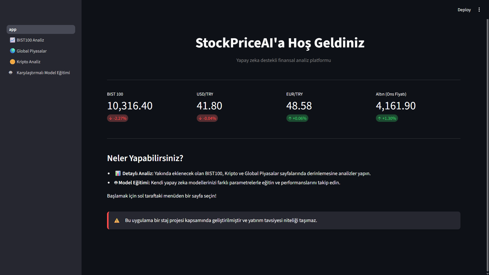
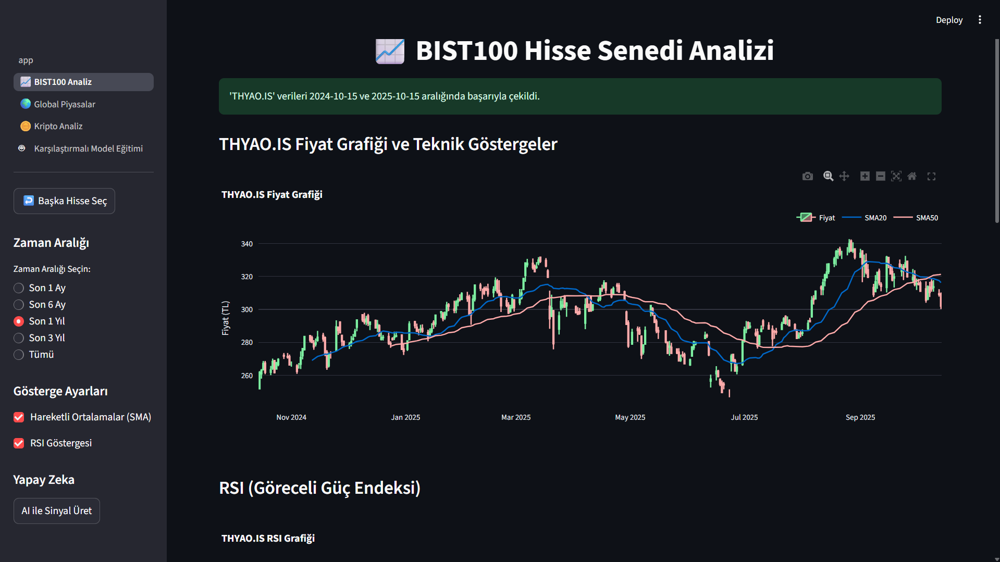
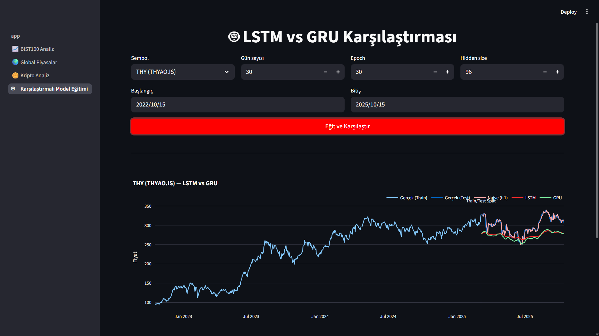

# StockPriceAI

StockPriceAI, finansal piyasaları analiz etmek ve farklı varlık gruplarının (BIST100, global piyasalar, kripto paralar) trendlerini anlamak için geliştirilmiş bir yapay zeka destekli analiz aracıdır. Bu proje kapsamında hem teknik analizler, hem de karşılaştırmalı modelleme yapılmaktadır.

> Not: Proje yapısı kökteki `StockPriceAI/` klasöründe organize edilmiştir.

## Özellikler

- 📥 **BIST100 Analizi**: Türkiye borsa endeksi için veri analizi
- 🌍 **Global Piyasalar**: Dünya borsalarına ait trend analizi
- 💰 **Kripto Piyasası**: Kripto paraların zaman serisi analizi
- 🧠 **Model Eğitimi**: LSTM / GRU gibi modellerin karşılaştırmalı eğitimi
- 📊 **Değerlendirme**: MAE/MSE/RMSE, loss grafikleri, gerçek vs. tahmin
- 🚀 **Tahmin**: Eğitimli modellerle ileriye dönük tahmin
- 🖥️ **Arayüz**: Streamlit üzerinden demo kullanımı

## Proje Yapısı

```text
StockPriceAI/
├─ app.py                     # Ana uygulama (Streamlit giriş noktası)
├─ model_utils.py             # Model fonksiyonları ve yardımcı metodlar
├─ pages/                     # Farklı analiz modülleri
│  ├─ 1_BIST100_Analiz.py
│  ├─ 2_Global_Piyasalar.py
│  ├─ 3_Kripto_Analiz.py
│  └─ 4_Karşılaştırmalı_Model_Eğitimi.py
├─ __pycache__/               # Python cache (ignore edilebilir)
└─ README.md
```

## Kurulum ve Çalıştırma

### Repoyu klonla:

```bash
git clone https://github.com/beytullahatasoy/StockPriceAI.git
cd StockPriceAI
```

### Sanal ortam oluştur ve bağımlılıkları yükle:

```bash
python -m venv venv
source venv/bin/activate   # Mac/Linux
venv\Scripts\activate      # Windows

pip install -r requirements.txt
```

```bash
streamlit run app.py    #Tarayıcıda http://localhost:8501 adresine git.
```

## Uygulamadan bazı görüntüler:

### Ana dayfa:

### Bist 100 sayfası:

### LSTM VE GRU Karşılaştırması:


## İletişim

Sorular ve öneriler için GitHub Issues bölümünü kullanabilirsiniz.
